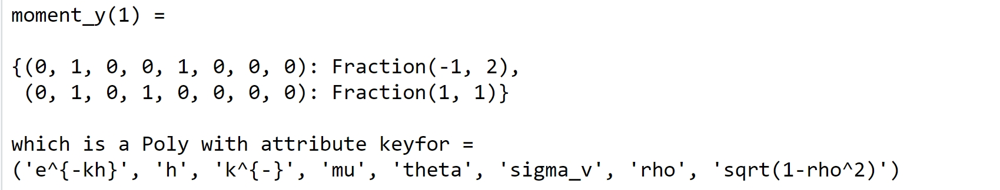
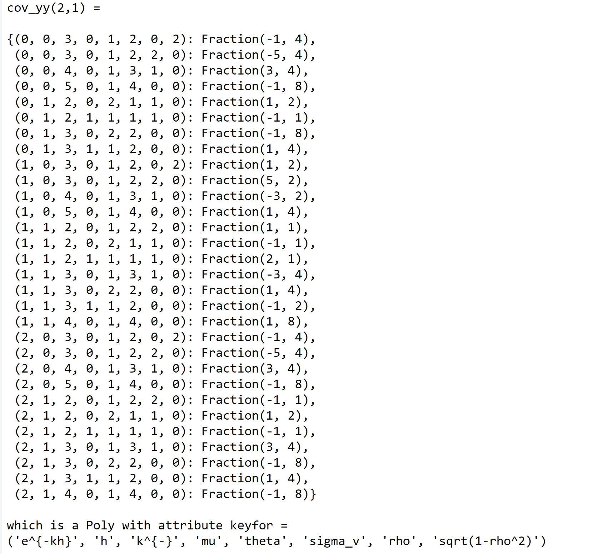
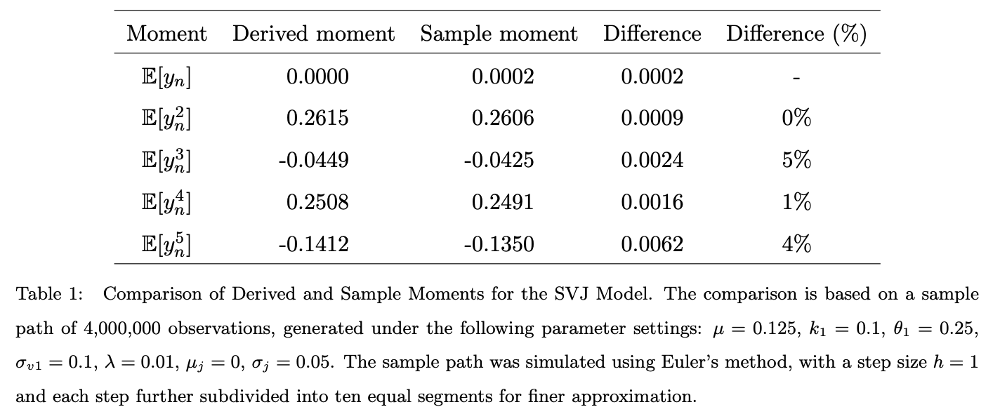
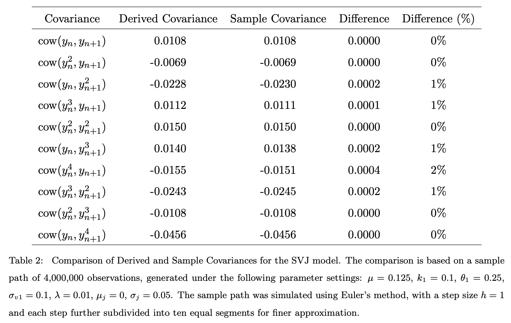

[](https://pubsonline.informs.org/journal/ijoc)

# ajdmom

This archive is distributed in association with the [INFORMS Journal on
Computing](https://pubsonline.informs.org/journal/ijoc) under the [MIT
License](LICENSE).

The software and data in this repository are a snapshot of the software
and data that were used in the research reported on in the paper
[ajdmom: a Python Package for Deriving Moments and Covariances of some
Affine Jump Diffusion Processes](https://doi.org/10.1287/ijoc.2019.0000)
by Yan-Feng Wu and Jian-Qiang Hu. The snapshot is based on [this
SHA](https://github.com/xmlongan/ajdmom/commit/958ffaa07eea293d83076368eea129c55efb1aac)
in the development repository.

**Important: This code is being developed on an on-going basis at
<https://github.com/xmlongan/ajdmom>. Please go there if you would like
to get a more recent version or would like support**

## Cite

To cite the contents of this repository, please cite both the paper and
this repo, using their respective DOIs.

<https://doi.org/10.1287/ijoc.2019.0000>

<https://doi.org/10.1287/ijoc.2019.0000.cd>

Below is the BibTex for citing this snapshot of the repository.

```         
@article{ajdmom,
  author =    {Yan-Feng Wu and Jian-Qiang Hu},
  publisher = {INFORMS Journal on Computing},
  title =     {ajdmom: a Python Package for Deriving Moments and Covariances of some Affine Jump Diffusion Processes},
  year =      {2023},
  doi =       {10.1287/ijoc.2019.0000.cd},
  url =       {https://github.com/INFORMSJoC/2019.0000},
  note =      {Available for download at https://github.com/xmlongan/ajdmom},
}
```

## Description

This package can automatically derive closed-form moment and covariance
formulas of any order for some Affine Jump Diffusion (AJD) models based
on a recursive moment-computing equation given by the authors. Thus, it
extends the tractability of these AJD models beyond closed-form
conditional Characteristic Function, which is our main contribution.

The `ajdmom` package currently supports the derivation of moment,
central moment and covariance formulas of any order for Heston
Stochastic Volatility model and its three AJD extensions. Their partial
derivatives with respect to parameters in the models can also be
derived. A typical usage of these moments and partial derivatives is to
help design method of moments estimators for the parameters of these
models. This plays an important role for estimating AJD models,
considering the facts that the likelihood function of AJD models does
not have a closed-form and is also non-convex. Of course, moments of AJD
models may have other applications.

## Building

Make sure you have the latest version of PyPA's build installed:

```         
python -m install --upgrade build
```

Now run this command from the same directory where `pyproject.toml` is
located:

```         
python -m build
```

This command should generate two files in the `dist` directory:

```         
dist/
├── ajdmom-1.0-py3-non-any.whl
├── ajdmom-1.0.tar.gz
```

The built distribution `ajdmom-1.0-py3-non-any.whl` can be installed by
running the following command from the `dist` directory:

```         
python -m pip install ajdmom-1.0-py3-non-any.whl
```

## Results

Figure 2 in the paper shows the results of deriving the first moment of
Heston Stochastic Volatility model.



Figure 4 in the paper shows the results of deriving the covariance
$cov(y_n^2,y_{n+1})$ of Heston Stochastic Volatility model.



Table 1 in the paper shows the comparison between derived moments and
sample moments of the One-Factor SV model with jumps in the return
process, based on simulated samples.



Table 2 in the paper shows the comparison between derived covariances
and sample covariances of the One-Factor SV model with jumps in the
return process, based on simulated samples.



## Replicating

### Demonstration

To replicate the results in [Figure 2](results/m1-1fsv.png), run this
command from the `scripts` directory:

```         
python example1.py
```

To replicate the results in [Figure 4](results/cov21-1fsv.png), run this
command from the `scripts` directory:

```         
python example2.py
```

### Experiments

To replicate the results in [Table 1](results/comp-mom-1fsvj.png), run
this command from the `scripts` directory:

```         
python experiment1.py
```

To replicate the results in [Table 2](results/comp-cov-1fsvj.png), run
this command from the `scripts` directory:

```         
python experiment2.py
```

It should be noted that the results in Tables 1 and 2 can not be
reproduced exactly since the sample moments and covariances used for
comparison are computed based on simulated samples which would change
per simulation.

## Ongoing Development

This code is being developed on an on-going basis at the author's
[Github site](https://github.com/xmlongan/ajdmom).

## Support

For support in using this software, submit an
[issue](https://github.com/xmlongan/ajdmom/issues/new).
